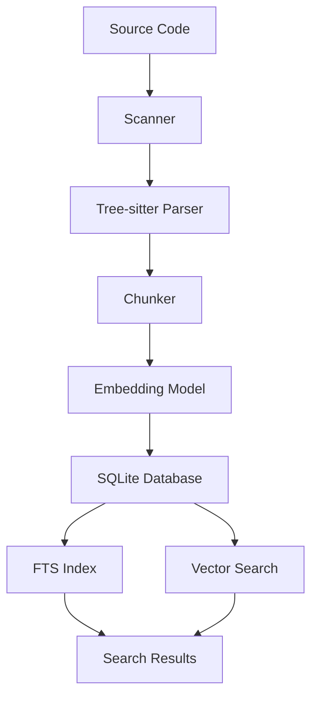

## Overview

Codemogger is a code indexing library built for AI coding agents. It parses source code with tree-sitter, chunks it into semantic units, embeds them locally, and stores everything in a single SQLite file with vector + full-text search capabilities.

<Info>
  No Docker, no server, no API keys. One `.db` file per codebase.
</Info>

## Core Components

### Runtime & Language

<CardGroup cols={2}>
  <Card title="Bun/TypeScript" icon="code">
    Fast JavaScript runtime with native TypeScript support
  </Card>
  <Card title="Tree-sitter (WASM)" icon="tree">
    AST-aware chunking with 14 language grammars
  </Card>
</CardGroup>

### Embedding & Storage

<CardGroup cols={2}>
  <Card title="all-MiniLM-L6-v2" icon="brain">
    Local embeddings (384 dimensions, q8 quantized)
  </Card>
  <Card title="Turso" icon="database">
    Embedded SQLite with FTS + vector search extensions
  </Card>
</CardGroup>

## Architecture Stack



## Processing Pipeline

<Steps>
  <Step title="Scan">
    Walk directory, respect `.gitignore`, detect language from file extension
  </Step>
  <Step title="Chunk">
    Parse each file with tree-sitter (WASM), extract top-level definitions (functions, structs, classes, impl blocks). Items >150 lines are split into sub-items.
  </Step>
  <Step title="Embed">
    Encode each chunk with the provided embedding model (runs locally, no API)
  </Step>
  <Step title="Store">
    Write chunks + embeddings to SQLite with FTS index
  </Step>
  <Step title="Search">
    Vector cosine similarity (semantic) or FTS with weighted fields (keyword)
  </Step>
</Steps>

## Database Schema

### Codebases Table

Stores metadata about indexed codebases.

```sql
CREATE TABLE codebases (
    id          INTEGER PRIMARY KEY AUTOINCREMENT,
    root_path   TEXT NOT NULL UNIQUE,
    name        TEXT NOT NULL DEFAULT '',
    indexed_at  INTEGER NOT NULL DEFAULT 0
)
```

### Chunks Table

Stores code chunks with embeddings and metadata.

```sql
CREATE TABLE chunks (
    id              INTEGER PRIMARY KEY AUTOINCREMENT,
    codebase_id     INTEGER NOT NULL REFERENCES codebases(id),
    file_path       TEXT NOT NULL,
    chunk_key       TEXT NOT NULL UNIQUE,
    language        TEXT NOT NULL,
    kind            TEXT NOT NULL,
    name            TEXT NOT NULL DEFAULT '',
    signature       TEXT NOT NULL DEFAULT '',
    snippet         TEXT NOT NULL,
    start_line      INTEGER NOT NULL,
    end_line        INTEGER NOT NULL,
    file_hash       TEXT NOT NULL,
    indexed_at      INTEGER NOT NULL,
    embedding       BLOB,
    embedding_model TEXT DEFAULT ''
)
```

### Indexed Files Table

Tracks which files have been indexed.

```sql
CREATE TABLE indexed_files (
    id          INTEGER PRIMARY KEY AUTOINCREMENT,
    codebase_id INTEGER NOT NULL REFERENCES codebases(id),
    file_path   TEXT NOT NULL,
    file_hash   TEXT NOT NULL,
    chunk_count INTEGER NOT NULL DEFAULT 0,
    indexed_at  INTEGER NOT NULL,
    UNIQUE(codebase_id, file_path)
)
```

### Per-Codebase FTS Tables

Each codebase gets its own FTS table for efficient keyword search.

```sql
CREATE TABLE fts_{codebase_id} (
    chunk_id    INTEGER NOT NULL REFERENCES chunks(id) ON DELETE CASCADE,
    name        TEXT NOT NULL DEFAULT '',
    signature   TEXT NOT NULL DEFAULT ''
)

CREATE INDEX idx_fts_{codebase_id} ON fts_{codebase_id}
    USING fts (name, signature)
    WITH (
        tokenizer = 'default',
        weights = 'name=5.0,signature=3.0'
    )
```

<Note>
  The FTS index uses weighted fields: `name` (weight 5.0) is prioritized over `signature` (weight 3.0) for better relevance.
</Note>

## Storage Optimization

### Vector Quantization

Embeddings use `vector8` (int8 quantized) format:

- **395 bytes/chunk** vs 1,536 bytes for float32
- **~75% storage reduction** with minimal quality loss
- All embeddings use the same quantized format for consistency

### Incremental Updates

Only changed files (detected by SHA-256 hash) are re-processed on subsequent runs:

<CodeGroup>
```typescript File Hash Tracking
// Stored in indexed_files table
file_hash: TEXT NOT NULL  // SHA-256 of file contents
```

```typescript Incremental Logic
// Only reindex if hash changed
if (currentHash !== storedHash) {
  await reindexFile(filePath)
}
```
</CodeGroup>

## Multi-Codebase Support

A single database file can store multiple codebases:

- **Global vector search** across all chunks
- **Per-codebase FTS tables** for isolated keyword search
- **Codebase filtering** in search queries

```typescript
// Search within specific codebase
await db.search("authentication middleware", {
  mode: "semantic",
  codebaseId: 1
})
```

## Dependencies

### Core Dependencies

| Package | Version | Purpose |
|---------|---------|----------|
| `@tursodatabase/database` | 0.5.0-pre.14 | SQLite with vector search |
| `web-tree-sitter` | 0.26.5 | Parser runtime |
| `@huggingface/transformers` | 3.8.1 | Embedding models |
| `@modelcontextprotocol/sdk` | 1.26.0 | MCP server support |

### Tree-sitter Grammars

| Language | Package | Version |
|----------|---------|----------|
| Rust | `tree-sitter-rust` | 0.24.0 |
| JavaScript | `tree-sitter-javascript` | 0.25.0 |
| TypeScript | `tree-sitter-typescript` | 0.23.2 |
| Python | `tree-sitter-python` | 0.25.0 |
| Go | `tree-sitter-go` | 0.25.0 |
| C | `tree-sitter-c` | 0.24.1 |
| C++ | `tree-sitter-cpp` | 0.23.4 |
| C# | `tree-sitter-c-sharp` | 0.23.1 |
| Java | `tree-sitter-java` | 0.23.5 |
| Scala | `tree-sitter-scala` | 0.24.0 |
| Zig | `@tree-sitter-grammars/tree-sitter-zig` | 1.1.2 |
| PHP | `tree-sitter-php` | 0.24.2 |
| Ruby | `tree-sitter-ruby` | 0.23.1 |

## Design Principles

<CardGroup cols={2}>
  <Card title="Local-First" icon="laptop">
    All processing happens locally. No external APIs or servers required.
  </Card>
  <Card title="Single File" icon="file">
    One `.db` file contains everything: chunks, embeddings, and indexes.
  </Card>
  <Card title="Fast Search" icon="bolt">
    Keyword search is 25-370x faster than ripgrep with better results.
  </Card>
  <Card title="Incremental" icon="refresh">
    Only changed files are reindexed, making updates fast.
  </Card>
</CardGroup>
