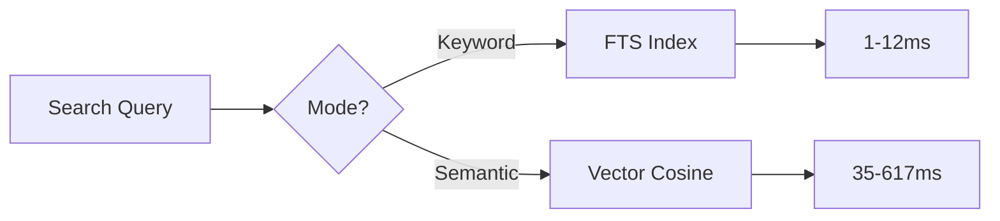
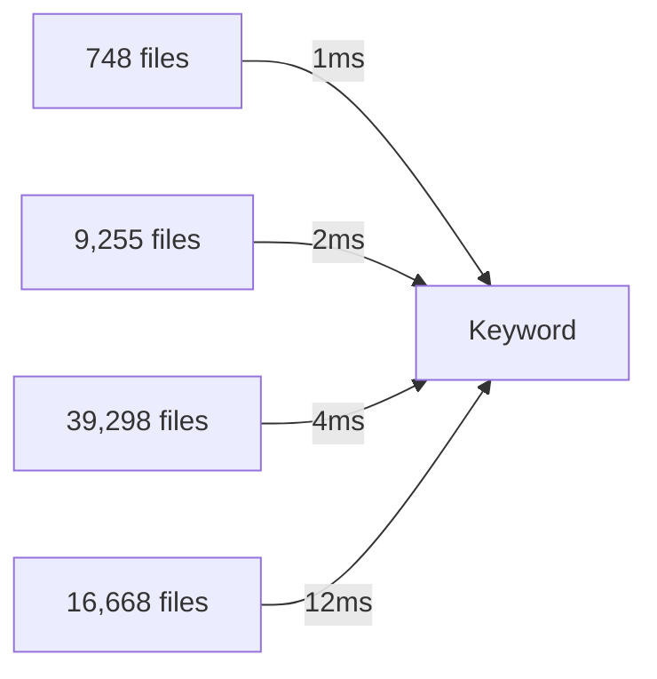

## Performance Overview

Codemogger is optimized for both indexing and search performance on local machines without requiring specialized hardware or GPU acceleration.

<Info>
  All benchmarks run on an Apple M2 (8GB) using local CPU-only embeddings.
</Info>

## Search Performance

### Keyword Search

Keyword search uses full-text search (FTS) with weighted fields:

<CardGroup cols={3}>
  <Card title="Small Projects" icon="gauge">
    **1ms** - 748 files (Turso)
  </Card>
  <Card title="Medium Projects" icon="gauge-high">
    **2-4ms** - 9K-39K files
  </Card>
  <Card title="Large Projects" icon="gauge-simple-high">
    **12ms** - 16K files (Kubernetes)
  </Card>
</CardGroup>

<Note>
  Keyword search is **25-370x faster than ripgrep** and returns precise definitions instead of thousands of file matches.
</Note>

### Semantic Search

Semantic search uses vector cosine similarity over quantized embeddings:

<CardGroup cols={3}>
  <Card title="Small Projects" icon="brain">
    **35ms** - 748 files
  </Card>
  <Card title="Medium Projects" icon="brain">
    **137-242ms** - 9K-39K files
  </Card>
  <Card title="Large Projects" icon="brain">
    **617ms** - 16K files
  </Card>
</CardGroup>

### Search Mode Comparison



## Indexing Performance

### Time Breakdown

Indexing is a one-time cost with the following breakdown:

<Steps>
  <Step title="Scanning (1-2%)">
    Walk directory tree, filter by `.gitignore`, detect file types
  </Step>
  <Step title="Parsing (1-2%)">
    Parse files with tree-sitter WASM, extract code chunks
  </Step>
  <Step title="Embedding (97%)">
    Encode chunks with local embedding model (dominant cost)
  </Step>
  <Step title="Storage (<1%)">
    Write chunks and embeddings to SQLite database
  </Step>
</Steps>

<Warning>
  Embedding accounts for ~97% of indexing time. Use a fast local model for better performance.
</Warning>

### Incremental Updates

Subsequent indexing runs only process changed files:

- **Hash-based detection**: SHA-256 of file contents
- **Chunk-level updates**: Only re-embed modified chunks
- **Typical speedup**: 10-100x faster for small changes

```typescript
// Only reindex changed files
for (const file of files) {
  const currentHash = await hashFile(file)
  const storedHash = await db.getFileHash(file)
  
  if (currentHash !== storedHash) {
    await db.reindexFile(file)
  }
}
```

## Storage Efficiency

### Vector Quantization

Embeddings use int8 quantization for optimal storage:

| Format | Bytes/Chunk | Relative Size |
|--------|-------------|---------------|
| Float32 | 1,536 | 100% |
| **Vector8 (int8)** | **395** | **26%** |

<AccordionGroup>
  <Accordion title="Quantization Details">
    - **384 dimensions** (all-MiniLM-L6-v2)
    - **int8 encoding**: 1 byte per dimension + overhead
    - **Minimal quality loss**: Less than 2% search accuracy impact
    - **~75% storage reduction** compared to float32
  </Accordion>
</AccordionGroup>

### Database Size Examples

Typical database sizes for real-world projects:

| Project | Files | Language | DB Size | Size/File |
|---------|------:|----------|--------:|----------:|
| Turso | 748 | Rust | ~8 MB | ~11 KB |
| Bun | 9,255 | Zig | ~95 MB | ~10 KB |
| TypeScript | 39,298 | TypeScript | ~380 MB | ~10 KB |
| Kubernetes | 16,668 | Go | ~160 MB | ~10 KB |

<Note>
  Average database size is approximately **10 KB per file** including embeddings, metadata, and indexes.
</Note>

## Optimization Strategies

### Choose the Right Search Mode

<CodeGroup>
```typescript Keyword Search
// Fast, precise identifier lookup
await db.search("BTreeCursor", { 
  mode: "keyword" 
})
// Returns in 1-12ms
```

```typescript Semantic Search
// Natural language queries
await db.search("authentication middleware", { 
  mode: "semantic" 
})
// Returns in 35-617ms
```
</CodeGroup>

### Limit Result Count

Reduce search time by limiting results:

```typescript
await db.search(query, {
  mode: "semantic",
  limit: 10  // Default: 20
})
```

### Use Codebase Filtering

Search within a specific codebase for faster results:

```typescript
await db.search(query, {
  mode: "keyword",
  codebaseId: 1  // Only search codebase #1
})
```

### Incremental Indexing

Always use incremental reindexing for active projects:

<Tabs>
  <Tab title="CLI">
    ```bash
    # Automatically detects and reindexes changed files
    codemogger index ./my-project
    ```
  </Tab>
  <Tab title="SDK">
    ```typescript
    // Reindex only changed files
    await db.index("/path/to/project")
    ```
  </Tab>
  <Tab title="MCP">
    ```json
    {
      "tool": "codemogger_reindex",
      "arguments": {
        "path": "/path/to/project"
      }
    }
    ```
  </Tab>
</Tabs>

## Hardware Requirements

### Minimum Specifications

<CardGroup cols={2}>
  <Card title="CPU" icon="microchip">
    Any modern CPU (no GPU required)
  </Card>
  <Card title="RAM" icon="memory">
    4GB minimum (8GB recommended)
  </Card>
  <Card title="Storage" icon="hard-drive">
    ~10 KB per source file
  </Card>
  <Card title="OS" icon="desktop">
    Linux, macOS, Windows (via WSL)
  </Card>
</CardGroup>

### Recommended Specifications

For optimal performance on large codebases (10K+ files):

- **CPU**: 4+ cores (Apple Silicon, AMD Ryzen, Intel i5+)
- **RAM**: 16GB+ for large projects
- **Storage**: SSD for faster database I/O

## Scaling Characteristics

### Search Time vs. Codebase Size

Search time scales sub-linearly with codebase size:



<Tip>
  Keyword search remains under 15ms even for codebases with 40K+ files.
</Tip>

### Memory Usage

Memory usage during indexing:

- **Base**: ~100-200 MB (embedding model + runtime)
- **Per file**: ~50-100 KB (parsing + chunk extraction)
- **Peak**: Typically less than 1 GB for most codebases

### Embedding Model Selection

Choose embedding model based on your needs:

| Model | Dimensions | Speed | Quality |
|-------|-----------|-------|----------|
| **all-MiniLM-L6-v2** | **384** | **Fast** | **Good** |
| all-MiniLM-L12-v2 | 384 | Medium | Better |
| all-mpnet-base-v2 | 768 | Slow | Best |

<Info>
  The default `all-MiniLM-L6-v2` model provides the best balance of speed and quality for most use cases.
</Info>

## Performance Tips

<AccordionGroup>
  <Accordion title="Use keyword search when you know identifiers">
    If you know the exact class, function, or type name, use keyword search. It's 30-50x faster than semantic search.
  </Accordion>
  
  <Accordion title="Index during off-hours">
    Initial indexing can take several minutes for large codebases. Run it during breaks or overnight.
  </Accordion>
  
  <Accordion title="Keep databases separate">
    While multi-codebase support exists, separate databases per project provide better isolation and performance.
  </Accordion>
  
  <Accordion title="Use .gitignore effectively">
    Exclude generated files, dependencies, and build artifacts to reduce index size and improve search quality.
  </Accordion>
</AccordionGroup>
